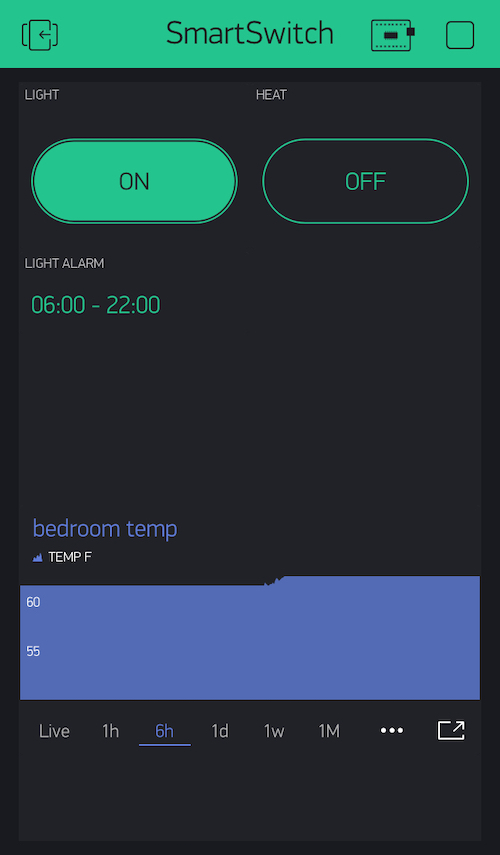

# Smart-Switch

Particle Photon app to control relays connected to a light and a heater.
See [Partner app](https://github.com/gallingern/Humidity-Temperature-Sunset) for humidity and temperature.

## Overview

I created this project for home automation.  We all have a tendency to stay up too late.  With lights that turn off at bedtime, it can help reinforce positive behavior.  I mimicked the behavior available on a Wemo smart switch that turns the lights on 30 minutes before sunset, and then turns them off at bedtime.  I also fade them on in the morning as an alarm.  

My other problem is that my apartment’s gas heater is in the living room.  In winter, the bedroom gets really cold at night.  I solved this problem by triggering a space heater in the morning before I wake up, based on a temperature sensor attached to a different Photon on the other side of the room (see partner app).  

## [Blynk App](https://github.com/blynkkk)

Screenshot of the blynk app I use to control lights, heat, and set light alarm.  At the bottom is a graph of the temperature in my bedroom over time.

## Parts

* Power Outlet Box
* Power Receptacle (2)
* Outlet wall plate
* [Particle Photon](https://store.particle.io/products/photon)
* 2 Relay Module (3.3 volt logic)
* [AC Light Dimmer Module](https://robotdyn.com/ac-light-dimmer-module-1-channel-3-3v-5v-logic-ac-50-60hz-220v-110v.html)
* Cannibalized AC to DC 5V adapter

