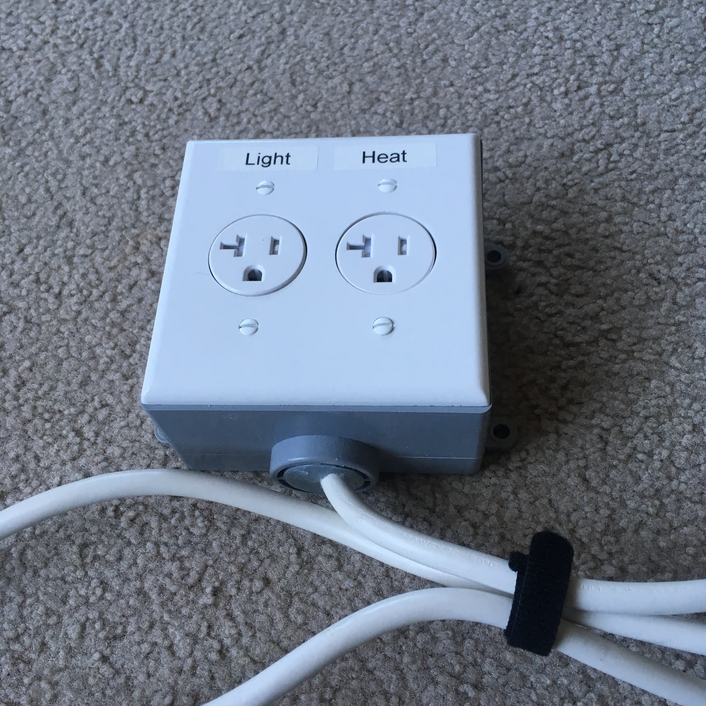

# Smart-Switch

Particle Photon app to control relays connected to a light and a heater.
See [Partner app](https://github.com/gallingern/Humidity-Temperature-Sunset) for humidity and temperature.

## Overview

I created this project for home automation.  We all have a tendency to stay up too late.  With lights that turn off at bedtime, it can help reinforce positive behavior.  I mimicked the behavior available on a Wemo smart switch that turns the lights on 30 minutes before sunset, and then turns them off at bedtime.  I also turn them on in the morning as an alarm.  

My other problem is that my apartment’s gas heater is in the living room.  In winter, the bedroom gets really cold at night.  I solved this problem by triggering a space heater in the morning before I wake up, based on a temperature sensor attached to a different Photon on the other side of the room (see partner app).  

## Implementation

Particle variables
* Temperature
* Sunset time (calculated in partner app due to memory constraints)

Light
* sunset
* morning

Heat
* morning

Blynk App
char auth[] = "<YOUR_AUTH_CODE_HERE>";
Virtual pin
* V0 - temperature (F)
* V1 - light switch
* V2 - heat switch

## Parts

* Enclosure
* Power Receptacle (2)
* Particle Photon
* Relay (2)

